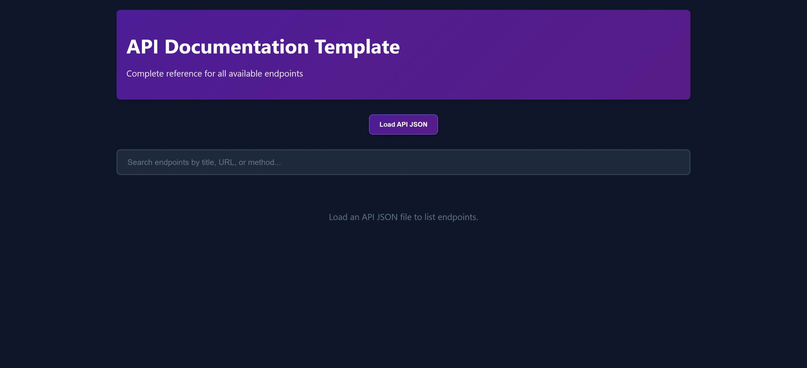
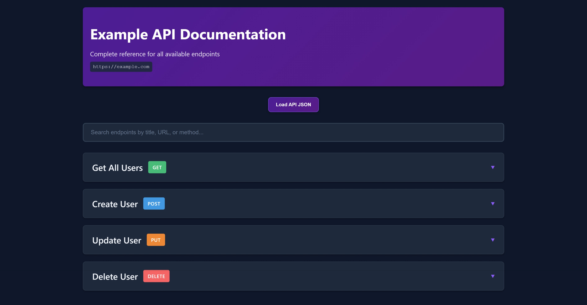
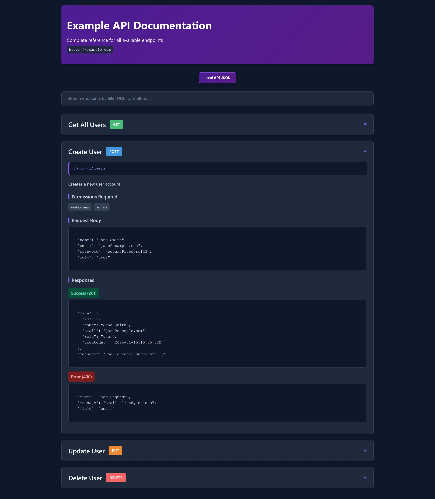
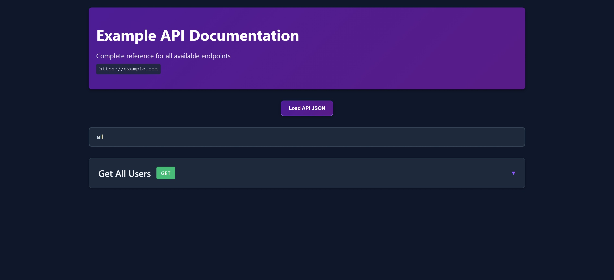

# API Doc

A small tool to simplify documenting APIs in order to make communication between backend and frontend developers easier

## Features

- Use of JSON files to document an API
- The doc loader can render any API doc as long as it follows the template's JSON structure
- Multiple API docs as JSON files and one doc loader which makes scaling API documentation easier
- Simple, smooth, and visually appealing UI.
- Easy to use, just have the JSON file and load it.
- Drop down style for API endpoints to make navigation and reading effortless
- Search API endpoints by title, URL, or name to make finding what you want easy once the API scales big.

## Tech Stack

- HTML
- CSS
- JavaScript
- JSON

## Setup & Usage

- Clone or download the repo to get the 'doc_loader'
- No need to install anything due to it using raw web technologies which are almost present everywhere
- Open the 'doc_loader'
- Click 'Load API JSON' and locate the 'api_doc_template' then select it to test and that's it
- For future personal use, create your own JSON API documentation using the same structure as in 'api_doc_template' and load it into the doc_loader
- TIP: To simplify creating JSON API documentation just send 'api_doc_template' and the code of the endpoints you have to a generative AI and ask it to build a JSON file with the same structure.

## Screenshots

  
  

  
  

  

## Author

H2SO4-1191 – Software Engineer
